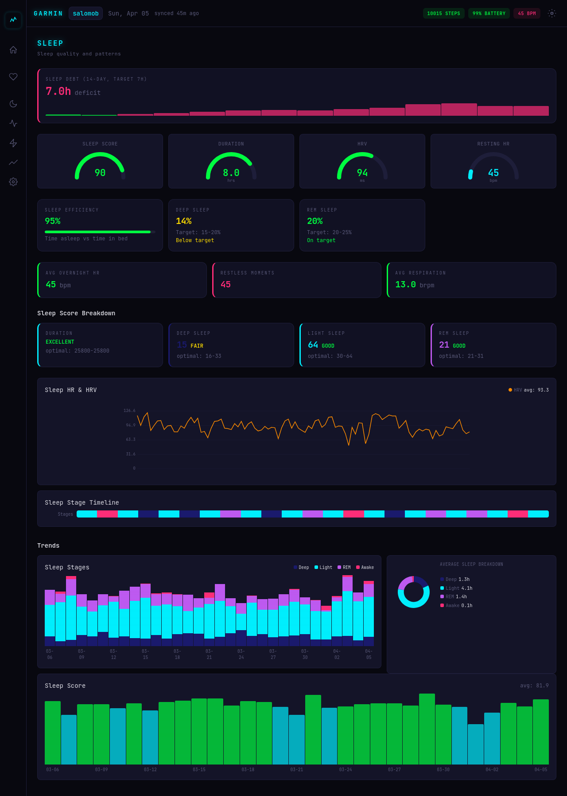

# Garmin API

Standalone Garmin Connect API service with event-driven architecture and a full health dashboard. Handles OAuth authentication, background data sync, encrypted credential storage, webhook-based event dispatch, and a Leptos WASM dashboard.

Extracted from [gorilla_coach](https://github.com/elmomk/gorilla_coach) to serve as a shared data source for multiple consumers (gorilla_coach, life_manager, etc.) over a Tailscale private network.

## Dashboard

Cyberpunk-themed health dashboard built with Leptos (Rust WASM), served via nginx.

| Dashboard | Training |
|-----------|----------|
|  |  |

| Sleep | Heart & Body |
|-------|-------------|
|  |  |

| Activity | Trends |
|----------|--------|
|  |  |

**7 pages:** Dashboard (recovery score, vitals, alerts, heatmap), Heart & Body (HR, HRV, stress, SpO2, respiration, weight/BMI), Sleep (debt, stages, efficiency, feedback, intraday), Activity (consistency, volume, exercise details), Training (readiness, VO2 max, fitness age, race predictions, load trends), Trends (30+ charts with section grouping, correlations), Settings.

## What it does

- Authenticates with Garmin Connect via SSO (OAuth1/OAuth2 + MFA support)
- Syncs 14 health endpoints in parallel: steps, heart rate, HRV, sleep, stress, body battery, weight, SpO2, respiration, training readiness, training status, activities, fitness age, race predictions
- Stores 50+ daily health metrics + intraday time series in SQLite
- Captures sleep score feedback (sub-score qualifiers, recommendations) and training readiness component breakdowns
- Emits webhook events to registered consumers with HMAC-SHA256 signing
- Exposes REST API for data queries, on-demand sync, credential management
- Full Leptos WASM dashboard with cyberpunk theme

## Stack

- **Rust** (Axum 0.8, Tokio) — backend API
- **Leptos 0.7** (CSR, WASM) — frontend dashboard
- **SQLite** (rusqlite + r2d2, WAL mode) — no DB container needed
- **ChaCha20Poly1305** encryption for credentials at rest
- **Docker + Tailscale** — 2 compose stacks (API + dashboard), sidecar networking

## Quick Start

```bash
# Generate keys and configure .env
cp .env.example .env
./scripts/gen-keys.sh

# Build and deploy backend
cargo build --release
docker compose up -d --build

# Build and deploy dashboard
cd frontend && trunk build --release
docker compose up -d --build

# Set up Garmin account
./scripts/garmin-setup.sh
```

## REST API

All `/api/v1` endpoints require `X-API-Key` header. `/health` is public.

| Method | Endpoint | Purpose |
|--------|----------|---------|
| POST | `/api/v1/users/{id}/credentials` | Register Garmin credentials |
| POST | `/api/v1/users/{id}/mfa` | Submit MFA code |
| DELETE | `/api/v1/users/{id}/credentials` | Remove credentials |
| GET | `/api/v1/users/{id}/status` | Connection status |
| POST | `/api/v1/users/{id}/sync` | Trigger on-demand sync |
| GET | `/api/v1/users/{id}/daily?date=YYYY-MM-DD` | Single day data |
| GET | `/api/v1/users/{id}/daily?start=...&end=...` | Date range |
| GET | `/api/v1/users/{id}/baseline?days=7` | N-day averages |
| GET | `/api/v1/users/{id}/vitals?sleep_target=7` | Today + 7-day baseline + sleep debt |
| GET | `/api/v1/users/{id}/activities` | Activities with optional date range |
| GET | `/api/v1/users/{id}/activities/{id}/gps` | GPS track data |
| GET | `/api/v1/users/{id}/intraday/{type}?date=...` | Intraday HR, stress, steps, respiration, HRV, sleep, body battery |
| GET | `/api/v1/users/{id}/daily-extended` | Extended metrics (fitness age, race predictions, stress breakdown) |
| POST | `/api/v1/webhooks` | Register webhook |
| GET | `/api/v1/webhooks` | List webhooks |
| DELETE | `/api/v1/webhooks/{id}` | Remove webhook |
| GET | `/health` | Health check |

## Events

Webhooks dispatched with HMAC-SHA256 signing and 3-retry exponential backoff.

| Event | When | Payload |
|-------|------|---------|
| `daily_data_synced` | Each day's data saved | Full daily data |
| `sync_completed` | Full sync finishes | `{ days_synced, errors, duration_secs }` |
| `sync_failed` | Auth/rate limit failure | `{ reason }` |
| `credentials_updated` | Credentials saved/MFA done | `{ status }` |

## Configuration

See [.env.example](.env.example) for all options.

| Variable | Default | Description |
|----------|---------|-------------|
| `MASTER_KEY` | required | Encryption key (min 32 bytes) |
| `API_KEYS` | required | `key:name` pairs, comma-separated |
| `SYNC_DAYS` | 30 | Days of history to sync |
| `SYNC_RATE_LIMIT_MINS` | 60 | Min interval between syncs per user |
| `GARMIN_API_DELAY_SECS` | 5 | Delay between per-day API calls |

## Scripts

| Script | Purpose |
|--------|---------|
| `scripts/gen-keys.sh` | Generate MASTER_KEY and API keys, update .env |
| `scripts/garmin-setup.sh` | Interactive Garmin account setup with MFA |
| `scripts/migrate-session.sh` | Migrate session from gorilla_coach |
| `scripts/e2e-test.sh` | Run end-to-end API tests |
| `scripts/build.sh` | Build release binary |
| `scripts/deploy.sh` | Build and deploy to Docker |
| `scripts/dev.sh` | Run locally for development |

## Architecture

```
garmin_api
├── Garmin Connect SSO ──── OAuth1/OAuth2 auth, MFA, token refresh
├── Sync Engine ─────────── Hourly background sync (14 parallel endpoints)
├── SQLite ──────────────── Encrypted credentials, daily + intraday data
├── Webhook Dispatcher ──── HMAC-signed event delivery with retries
├── REST API ────────────── Axum handlers with API key auth
└── Dashboard ─────────────  Leptos WASM frontend (7 pages, nginx)
```

Consumers (gorilla_coach, life_manager) subscribe to webhook events and/or query the REST API. No direct Garmin API knowledge needed in consumers.
